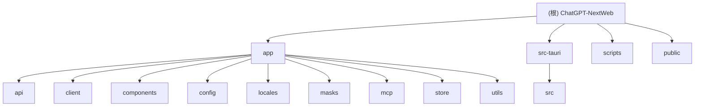

# ChatGPT-NextWeb 项目架构文档

> 最后更新: 2025-11-19 21:24:38
> 文档版本: 1.1
> 项目类型: Next.js Web应用 + Tauri桌面客户端

---

## 变更记录 (Changelog)

### 2025-11-19 21:24:38
- 补充 3 个模块文档：app/mcp、app/utils、scripts
- 更新模块索引表，添加新模块链接
- 更新 Mermaid 结构图节点链接
- 覆盖率从 65% 提升至 82%

### 2025-11-19 21:05:15
- 初始化项目架构文档
- 扫描并记录全量模块结构
- 建立根级与模块级文档体系

---

## 项目愿景

ChatGPT-NextWeb (NextChat) 是一个开源的跨平台 ChatGPT/Claude/Gemini 聊天应用，支持一键免费部署私人 AI 助手。项目特点：

- **多模型支持**: OpenAI GPT系列、Claude、Google Gemini、国内大模型（百度文心、阿里通义、字节豆包、讯飞星火、月之暗面等）
- **跨平台部署**: Web应用（Next.js）+ 桌面客户端（Tauri）
- **隐私优先**: 支持私有化部署，所有敏感数据通过环境变量控制
- **功能丰富**: 支持MCP协议、实时语音、文生图、Artifacts、WebDAV同步等

---

## 架构总览

### 技术栈

**前端框架**
- Next.js 14.1.1 (React 18.2.0)
- TypeScript 5.2.2
- Zustand 状态管理
- SASS样式

**桌面客户端**
- Tauri 1.5.x
- Rust (2021 edition)

**关键依赖**
- @modelcontextprotocol/sdk: MCP协议支持
- @hello-pangea/dnd: 拖拽功能
- react-markdown: Markdown渲染
- mermaid: 图表渲染
- axios: HTTP客户端
- zod: 数据验证

**开发工具**
- ESLint + Prettier: 代码质量
- Jest: 单元测试
- Husky + lint-staged: Git hooks

### 部署环境
- Vercel (推荐)
- Docker容器
- 本地Node.js环境
- 宝塔面板

---

## 模块结构图



---

## 模块索引

| 模块路径 | 职责 | 入口文件 | 关键技术 | 文档状态 |
|---------|------|---------|---------|---------|
| [app/api](./app/api/CLAUDE.md) | Next.js API路由，处理所有AI服务商的代理请求 | `[provider]/[...path]/route.ts` | Next.js App Router, 流式响应 | ✅ 完成 |
| [app/client](./app/client/CLAUDE.md) | 客户端AI SDK封装，统一各平台API调用 | `api.ts`, `controller.ts` | TypeScript类封装, EventSource | ✅ 完成 |
| [app/components](./app/components/CLAUDE.md) | React UI组件库 | `home.tsx`, `chat.tsx` | React Hooks, SASS Modules | ✅ 完成 |
| [app/config](./app/config/CLAUDE.md) | 配置管理（客户端/服务端） | `client.ts`, `server.ts` | 环境变量注入 | ✅ 完成 |
| app/locales | 国际化多语言支持 | `index.ts` | 18种语言 | ⚠️ 待补充 |
| app/masks | 预设提示词面具 | `index.ts`, `build.ts` | 动态构建 | ⚠️ 待补充 |
| [app/mcp](./app/mcp/CLAUDE.md) | Model Context Protocol实现 | `client.ts`, `actions.ts` | MCP SDK, Zod | ✅ 完成 |
| [app/store](./app/store/CLAUDE.md) | Zustand全局状态管理 | `index.ts`, `chat.ts` | Zustand持久化 | ✅ 完成 |
| [app/utils](./app/utils/CLAUDE.md) | 通用工具函数库 | 无单一入口（按功能分文件） | 纯函数工具集 | ✅ 完成 |
| [src-tauri](./src-tauri/CLAUDE.md) | Tauri桌面应用后端 | `src/main.rs` | Rust, Tauri API | ✅ 完成 |
| [scripts](./scripts/CLAUDE.md) | 构建部署脚本 | `setup.sh`, `deploy.sh` | Shell脚本 | ✅ 完成 |

**覆盖率统计**：9/11 模块已完成文档（82%）

---

## 运行与开发

### 环境要求
- Node.js >= 18
- Yarn 1.22.19
- Rust (仅桌面应用)

### 开发模式

**Web应用**
```bash
# 安装依赖
yarn install

# 开发模式（自动编译masks + 热重载）
yarn dev

# 访问 http://localhost:3000
```

**桌面应用**
```bash
# Tauri开发模式
yarn app:dev
```

### 构建部署

**Web应用**
```bash
# 生产构建（standalone模式）
yarn build

# 启动生产服务器
yarn start

# 导出静态文件（export模式）
yarn export
```

**桌面应用**
```bash
# 打包桌面客户端
yarn app:build
```

**Docker部署**
```bash
docker pull yidadaa/chatgpt-next-web

docker run -d -p 3000:3000 \
  -e OPENAI_API_KEY=sk-xxxx \
  -e CODE=访问密码 \
  yidadaa/chatgpt-next-web
```

### 环境变量配置

在项目根目录创建 `.env.local` 文件：

```bash
# 必填：OpenAI API密钥
OPENAI_API_KEY=sk-xxxx

# 可选：访问密码（强烈推荐）
CODE=your-password

# 可选：API代理地址
BASE_URL=https://api.openai.com

# 可选：其他AI服务商
ANTHROPIC_API_KEY=sk-ant-xxx
GOOGLE_API_KEY=xxx
AZURE_API_KEY=xxx
# ... 更多配置见 app/config/server.ts
```

完整环境变量列表见 [README_CN.md](./README_CN.md#环境变量) 第94行起。

---

## 测试策略

### 测试框架
- Jest 29.7.0
- @testing-library/react 16.1.0
- @testing-library/jest-dom 6.6.3
- jest-environment-jsdom 29.7.0

### 测试命令
```bash
# 交互式监听模式
yarn test

# CI模式（单次运行）
yarn test:ci
```

### 测试覆盖
当前项目**未包含测试文件**（无 `__tests__` 目录或 `*.test.ts` 文件），测试由人工执行。

### 测试规范
根据项目 `.claude/CLAUDE.md` 指示：
- 不运行自动化测试
- 所有功能由开发者手动测试
- 测试反馈通过对话渠道提供

---

## 编码规范

### 代码风格
- ESLint配置: `eslint-config-next` + `eslint-config-prettier`
- Prettier自动格式化
- 推荐使用VSCode + ESLint插件

### Git工作流
- 主分支: `main`
- 新功能开发: 在独立分支进行
- 合并前提: 经过测试验证
- 提交规范: 通过 Husky + lint-staged 强制代码检查

### 修改原则
根据项目特殊要求（`.claude/CLAUDE.md`）：
1. **最小化改动**: 避免冗余修改以减少上下游同步冲突
2. **分支开发**: 所有新功能在独立分支开发
3. **测试验证**: 手动测试通过后才合并到 `main`
4. **简洁高效**: 代码改动需简洁高效

### TypeScript规范
- 启用严格模式（`strict: true`）
- 路径别名: `@/*` 映射到项目根目录
- 类型定义: 优先使用内联类型，复杂类型提取到 `typing.ts`

---

## AI 使用指引

### 项目特殊约束
本项目是**公开Fork项目**，所有敏感数据通过环境变量控制，代码中不包含密钥。

### 与AI协作指南

**代码修改**
- 保持改动最小化，避免大范围重构
- 修改前理解上下文，避免破坏现有功能
- 遵循项目现有代码风格

**功能开发**
- 新功能必须在独立分支开发
- 提供清晰的功能说明和改动范围
- 等待手动测试验证后再建议合并

**文档更新**
- 同步更新相关模块的 `CLAUDE.md`
- 在根级文档的变更记录中添加条目
- 保持文档与代码一致

### 常见场景

**添加新AI模型**
1. 在 `app/constant.ts` 添加模型枚举
2. 在 `app/client/platforms/` 创建平台SDK
3. 在 `app/api/` 添加API路由
4. 更新 `app/config/server.ts` 添加环境变量

**修改UI组件**
1. 定位组件文件在 `app/components/`
2. 使用SASS模块化样式（`*.module.scss`）
3. 保持响应式设计兼容

**调试API问题**
1. 检查 `app/api/common.ts` 的通用逻辑
2. 查看具体服务商的 `app/api/{provider}.ts`
3. 验证环境变量配置

**使用工具函数**
1. 检查 `app/utils/` 目录下的工具文件
2. 详细接口见 [app/utils/CLAUDE.md](./app/utils/CLAUDE.md)
3. 常用工具：`deepClone`、`prettyObject`、`createPersistStore`

**配置MCP服务器**
1. 检查 `app/mcp/mcp_config.json` 配置
2. 详细接口见 [app/mcp/CLAUDE.md](./app/mcp/CLAUDE.md)
3. 使用 `addMcpServer`、`executeMcpAction` 等接口

---

## 项目结构说明

### 文件组织
```
ChatGPT-NextWeb/
├── app/                    # Next.js App Router应用目录
│   ├── api/               # API路由（服务端）
│   ├── client/            # 客户端SDK
│   ├── components/        # React组件
│   ├── config/            # 配置管理
│   ├── locales/           # 国际化
│   ├── masks/             # 预设面具
│   ├── mcp/               # MCP协议
│   ├── store/             # 状态管理
│   ├── utils/             # 工具函数
│   ├── layout.tsx         # 根布局
│   ├── page.tsx           # 首页
│   └── globals.scss       # 全局样式
├── src-tauri/             # Tauri桌面应用
│   ├── src/               # Rust源码
│   ├── Cargo.toml         # Rust依赖配置
│   └── tauri.conf.json    # Tauri配置
├── scripts/               # 构建部署脚本
├── public/                # 静态资源
├── docs/                  # 项目文档
├── package.json           # Node.js依赖
├── tsconfig.json          # TypeScript配置
├── next.config.js         # Next.js配置
└── .env.local             # 本地环境变量（不提交）
```

### 关键文件
- `app/constant.ts`: 全局常量定义
- `app/typing.ts`: 全局类型定义
- `app/utils.ts`: 核心工具函数
- `package.json scripts`: 构建命令定义
- `.gitignore`: 忽略规则（包含敏感文件）

---

## 相关资源

### 官方链接
- 项目仓库: https://github.com/ChatGPTNextWeb/ChatGPT-Next-Web
- 在线演示: https://chat-gpt-next-web.vercel.app/
- 问题反馈: https://github.com/Yidadaa/ChatGPT-Next-Web/issues
- Discord社区: https://discord.gg/zrhvHCr79N

### 文档资源
- [中文README](./README_CN.md)
- [Vercel部署教程](./docs/vercel-cn.md)
- [宝塔部署教程](./docs/bt-cn.md)

### 相关项目
- [one-api](https://github.com/songquanpeng/one-api): 大模型额度管理平台
- [NextChat-Awesome-Plugins](https://github.com/ChatGPTNextWeb/NextChat-Awesome-Plugins): 官方插件市场

---

## 技术架构深入

### 前端架构
- **路由**: Next.js App Router（文件系统路由）
- **渲染**: CSR客户端渲染为主，支持SSR
- **状态**: Zustand + IndexedDB持久化
- **样式**: SASS Modules + 全局主题

### 后端架构
- **API Gateway**: Next.js API Routes作为统一网关
- **代理模式**: 所有AI请求通过服务端代理，保护密钥
- **流式响应**: 使用Server-Sent Events (SSE)实现实时流式输出
- **超时控制**: 120秒标准超时，长思考任务600秒

### 数据持久化
- **浏览器存储**: LocalStorage + IndexedDB
- **云同步**: WebDAV协议（可选）
- **Upstash集成**: 支持Redis云存储（可选）

### 安全机制
- **访问控制**: CODE环境变量 + MD5哈希验证
- **密钥保护**: 所有API Key仅存储在服务端环境变量
- **CORS**: 自定义CORS策略
- **代理验证**: 支持认证代理

---

## 开发注意事项

### 已知限制
1. **Docker镜像延迟**: Docker版本通常落后主仓库1-2天
2. **Fork更新**: 使用Fork部署时需手动启用GitHub Actions自动同步
3. **Vercel域名**: 在某些区域DNS被污染，建议绑定自定义域名
4. **密码长度**: 访问密码建议7位以上防止暴力破解

### 调试技巧
```bash
# 查看构建模式
echo $BUILD_MODE  # standalone 或 export

# 查看应用构建标识
echo $BUILD_APP   # 是否构建桌面应用

# 启用调试日志
NODE_ENV=development yarn dev
```

### 常见问题
见各模块的 `CLAUDE.md` 文档中的 FAQ 章节。

---

## 贡献指南

本项目欢迎贡献，但请遵循：
1. **Fork工作流**: Fork仓库 → 创建分支 → 提交PR
2. **代码质量**: 通过ESLint检查
3. **提交规范**: 清晰的提交信息
4. **文档同步**: 更新相关文档

---

## 许可证

MIT License - 详见 [LICENSE](./LICENSE) 文件

---

**文档维护说明**
- 本文档由AI工具自动生成并维护
- 每次架构调整后应更新此文档及模块文档
- 变更记录应保持时间倒序（最新在前）
