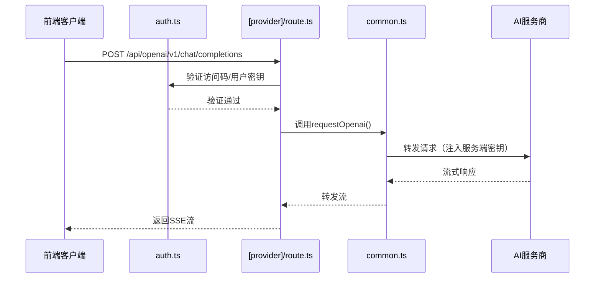

# app/api 模块文档

[根目录](../../CLAUDE.md) > [app](..) > **api**

---

## 变更记录

### 2025-11-19 21:05:15

- 初始化模块文档
- 记录所有AI服务商API路由

---

## 模块职责

`app/api` 是 Next.js API Routes 目录，作为**服务端代理层**，负责：

1. 接收前端客户端的AI请求
2. 验证访问权限（CODE验证）
3. 注入服务端API密钥（保护敏感信息）
4. 转发请求到各AI服务商
5. 处理流式响应（SSE）
6. 返回结果给客户端

**核心优势**: 前端不暴露API密钥，所有密钥通过环境变量在服务端管理。

---

## 对外接口

### API路由列表

| 路由路径                                  | 对应服务商   | 请求方式 | 功能                       |
| ----------------------------------------- | ------------ | -------- | -------------------------- |
| `/api/openai/*`                           | OpenAI       | POST     | GPT系列模型请求            |
| `/api/azure/*`                            | Azure OpenAI | POST     | Azure部署的OpenAI模型      |
| `/api/anthropic`                          | Anthropic    | POST     | Claude模型请求             |
| `/api/google`                             | Google       | POST     | Gemini模型请求             |
| `/api/baidu`                              | 百度文心     | POST     | 文心一言模型               |
| `/api/bytedance`                          | 字节跳动     | POST     | 豆包模型                   |
| `/api/alibaba`                            | 阿里云       | POST     | 通义千问模型               |
| `/api/tencent/route.ts`                   | 腾讯         | POST     | 混元模型                   |
| `/api/moonshot`                           | 月之暗面     | POST     | Moonshot模型               |
| `/api/iflytek`                            | 讯飞         | POST     | 星火模型                   |
| `/api/deepseek`                           | DeepSeek     | POST     | DeepSeek模型               |
| `/api/xai`                                | xAI          | POST     | Grok模型                   |
| `/api/chatglm`                            | 智谱AI       | POST     | ChatGLM模型                |
| `/api/siliconflow`                        | 硅基流动     | POST     | SiliconFlow模型            |
| `/api/302ai`                              | 302.AI       | POST     | 302.AI聚合API              |
| `/api/stability`                          | Stability AI | POST     | 文生图（Stable Diffusion） |
| `/api/config/route.ts`                    | 配置获取     | GET      | 获取服务端配置             |
| `/api/artifacts/route.ts`                 | Artifacts    | POST     | 保存/获取Artifacts数据     |
| `/api/webdav/[...path]/route.ts`          | WebDAV       | ALL      | WebDAV同步代理             |
| `/api/upstash/[action]/[...key]/route.ts` | Upstash      | ALL      | Upstash云存储代理          |
| `/api/[provider]/[...path]/route.ts`      | 通用代理     | ALL      | 动态路由处理               |

### 通用请求格式

所有AI请求的基本格式：

```typescript
POST /api/{provider}/v1/chat/completions
Headers:
  Authorization: Bearer {access-code-or-user-api-key}
  Content-Type: application/json

Body:
{
  model: string,
  messages: Array<{role: string, content: string}>,
  stream?: boolean,
  temperature?: number,
  // ... 其他模型参数
}
```

### 响应格式

**流式响应** (stream=true)

```
Content-Type: text/event-stream

data: {"choices":[{"delta":{"content":"Hello"}}]}
data: {"choices":[{"delta":{"content":" world"}}]}
data: [DONE]
```

**非流式响应**

```json
{
  "id": "chatcmpl-xxx",
  "object": "chat.completion",
  "created": 1234567890,
  "model": "gpt-3.5-turbo",
  "choices": [
    {
      "message": {
        "role": "assistant",
        "content": "Hello! How can I help you?"
      },
      "finish_reason": "stop"
    }
  ]
}
```

---

## 入口与启动

### 关键入口文件

**通用代理处理**

- `[provider]/[...path]/route.ts`: 动态路由，处理所有服务商的通用请求

**公共逻辑**

- `common.ts`: 共享的代理逻辑（OpenAI兼容格式）
- `auth.ts`: 访问权限验证

**特定服务商**
每个服务商有独立文件，例如：

- `openai.ts`: OpenAI特定逻辑
- `anthropic.ts`: Claude特定逻辑
- `google.ts`: Gemini特定逻辑
- 等等...

### 调用流程



---

## 关键依赖与配置

### 依赖项

- `next/server`: Next.js服务端API
- `@/app/config/server`: 服务端配置（环境变量）
- `@/app/utils/model`: 模型工具函数
- `@/app/utils/cloudflare`: Cloudflare AI Gateway支持

### 环境变量（服务端）

在 `app/config/server.ts` 中定义，通过 `.env.local` 或部署平台注入：

```bash
# 访问控制
CODE=password1,password2

# OpenAI
OPENAI_API_KEY=sk-xxx
BASE_URL=https://api.openai.com
OPENAI_ORG_ID=org-xxx

# Azure
AZURE_URL=https://{resource}.openai.azure.com/openai/deployments/{model}
AZURE_API_KEY=xxx
AZURE_API_VERSION=2023-05-15

# Anthropic
ANTHROPIC_API_KEY=sk-ant-xxx
ANTHROPIC_URL=https://api.anthropic.com
ANTHROPIC_API_VERSION=2023-06-01

# 其他服务商类似...

# 代理
PROXY_URL=http://127.0.0.1:7890

# Cloudflare AI Gateway（可选）
CLOUDFLARE_ACCOUNT_ID=xxx
CLOUDFLARE_KV_NAMESPACE_ID=xxx
CLOUDFLARE_KV_API_KEY=xxx
```

完整列表见 [根目录 CLAUDE.md](../../CLAUDE.md#运行与开发)。

---

## 数据模型

### 内部类型定义

在 `common.ts` 和各服务商文件中定义：

**请求类型**

```typescript
interface ChatRequest {
  model: string;
  messages: Array<{
    role: "system" | "user" | "assistant";
    content: string | MultimodalContent[];
  }>;
  stream?: boolean;
  temperature?: number;
  max_tokens?: number;
  // ... 其他参数
}
```

**响应类型**

```typescript
interface ChatResponse {
  id: string;
  object: string;
  created: number;
  model: string;
  choices: Array<{
    message?: { role: string; content: string };
    delta?: { content?: string };
    finish_reason?: string;
  }>;
  usage?: {
    prompt_tokens: number;
    completion_tokens: number;
    total_tokens: number;
  };
}
```

### 特殊数据格式

**多模态内容**（支持图片）

```typescript
type MultimodalContent = {
  type: "text" | "image_url";
  text?: string;
  image_url?: { url: string };
};
```

**阿里云格式**（特殊）

```typescript
interface MultimodalContentForAlibaba {
  text?: string;
  image?: string; // base64或URL
}
```

---

## 核心逻辑

### 1. 权限验证 (auth.ts)

```typescript
export function auth(req: NextRequest, modelProvider: string) {
  const authToken = req.headers.get("Authorization")?.replace("Bearer ", "");

  // 1. 检查是否是访问码（nk-前缀）
  if (authToken?.startsWith(ACCESS_CODE_PREFIX)) {
    const accessCode = authToken.slice(ACCESS_CODE_PREFIX.length);
    if (!serverConfig.codes.has(md5.hash(accessCode))) {
      return { error: true, msg: "Invalid access code" };
    }
    return { error: false };
  }

  // 2. 检查是否允许用户自定义密钥
  if (serverConfig.hideUserApiKey) {
    return { error: true, msg: "User API key not allowed" };
  }

  // 3. 验证用户提供的API密钥格式
  // ...
}
```

### 2. 通用代理 (common.ts)

核心函数 `requestOpenai()`:

1. 解析请求路径和参数
2. 构建目标URL（处理Azure特殊路径）
3. 注入服务端密钥或验证用户密钥
4. 设置超时控制（10分钟）
5. 转发请求到AI服务商
6. 流式转发响应

### 3. 流式响应处理

使用 `ReadableStream` 和 `TransformStream`:

```typescript
const stream = new ReadableStream({
  async start(controller) {
    const reader = response.body.getReader();
    while (true) {
      const { done, value } = await reader.read();
      if (done) break;
      controller.enqueue(value);
    }
    controller.close();
  },
});

return new Response(stream, {
  headers: { "Content-Type": "text/event-stream" },
});
```

### 4. 特定服务商适配

每个服务商有独特处理逻辑：

- **OpenAI/Azure**: 标准OpenAI格式
- **Anthropic**: 需要特定版本头 `anthropic-version`
- **Google Gemini**: 不同的API路径和响应格式
- **百度**: 需要OAuth2令牌交换
- **字节跳动**: Endpoint ID映射
- **讯飞**: WebSocket握手（特殊）

---

## 测试与质量

### 测试策略

- **手动测试**: 根据项目要求，由开发者手动测试所有API
- **测试点**:
  - 各服务商API连通性
  - 访问码验证逻辑
  - 流式响应完整性
  - 错误处理和超时控制

### 调试技巧

**启用详细日志**

```typescript
console.log("[Proxy]", path);
console.log("[Base Url]", baseUrl);
console.log("[Auth]", authToken?.slice(0, 10) + "...");
```

**测试单个服务商**

```bash
curl -X POST http://localhost:3000/api/openai/v1/chat/completions \
  -H "Authorization: Bearer nk-your-code" \
  -H "Content-Type: application/json" \
  -d '{
    "model": "gpt-3.5-turbo",
    "messages": [{"role":"user","content":"Hello"}],
    "stream": true
  }'
```

---

## 常见问题 (FAQ)

### Q1: 如何添加新的AI服务商？

1. 在 `app/api/` 创建新文件 `{provider}.ts`
2. 实现代理逻辑（参考 `common.ts`）
3. 在 `app/constant.ts` 添加 `ApiPath` 和 `ServiceProvider` 枚举
4. 在 `app/config/server.ts` 添加环境变量定义
5. 在 `app/client/platforms/` 添加客户端SDK

### Q2: 为什么不直接在前端调用AI API？

**安全原因**: 如果在前端调用，API密钥会暴露在浏览器中，任何人都能窃取。通过服务端代理，密钥仅存储在服务器环境变量中，对用户不可见。

### Q3: 流式响应中断如何处理？

检查以下几点：

- 超时设置是否合理（默认10分钟）
- 网络代理是否稳定（`PROXY_URL`）
- AI服务商是否限流
- 客户端是否正确处理 `[DONE]` 标记

### Q4: Azure部署名称如何配置？

使用 `CUSTOM_MODELS` 环境变量：

```bash
CUSTOM_MODELS="+gpt-3.5-turbo@Azure=gpt35"
```

这会将 `gpt-3.5-turbo` 映射到Azure的 `gpt35` 部署。

### Q5: 如何启用Cloudflare AI Gateway？

设置环境变量：

```bash
CLOUDFLARE_ACCOUNT_ID=your-account-id
CLOUDFLARE_KV_NAMESPACE_ID=your-namespace-id
CLOUDFLARE_KV_API_KEY=your-api-key
```

---

## 相关文件清单

### 核心文件

```
app/api/
├── common.ts              # 通用代理逻辑（OpenAI兼容）
├── auth.ts                # 访问权限验证
├── proxy.ts               # 代理配置
├── [provider]/[...path]/route.ts  # 动态路由处理
│
├── openai.ts              # OpenAI专用逻辑
├── azure.ts               # Azure OpenAI
├── anthropic.ts           # Claude
├── google.ts              # Gemini
├── baidu.ts               # 百度文心
├── bytedance.ts           # 字节豆包
├── alibaba.ts             # 阿里通义
├── tencent/route.ts       # 腾讯混元
├── moonshot.ts            # 月之暗面
├── iflytek.ts             # 讯飞星火
├── deepseek.ts            # DeepSeek
├── xai.ts                 # xAI Grok
├── glm.ts                 # 智谱ChatGLM
├── siliconflow.ts         # 硅基流动
├── 302ai.ts               # 302.AI
├── stability.ts           # Stability AI文生图
│
├── config/route.ts        # 配置API
├── artifacts/route.ts     # Artifacts存储
├── webdav/[...path]/route.ts    # WebDAV同步
└── upstash/[action]/[...key]/route.ts  # Upstash存储
```

### 依赖关系图

```
[provider]/route.ts
    ↓ imports
auth.ts ← serverConfig (config/server.ts)
    ↓
common.ts
    ↓ fetch
AI服务商API
```

---

## 开发注意事项

1. **错误处理**: 所有代理函数需要捕获异常并返回友好错误信息
2. **日志脱敏**: 不要记录完整的API密钥，仅记录前几位
3. **超时控制**: 不同类型请求设置不同超时（标准120s，长思考600s）
4. **流式转发**: 确保正确关闭流，避免内存泄漏
5. **CORS配置**: 处理跨域请求时注意安全策略

---

**文档维护**: 添加新服务商或修改API逻辑时，需同步更新此文档。
