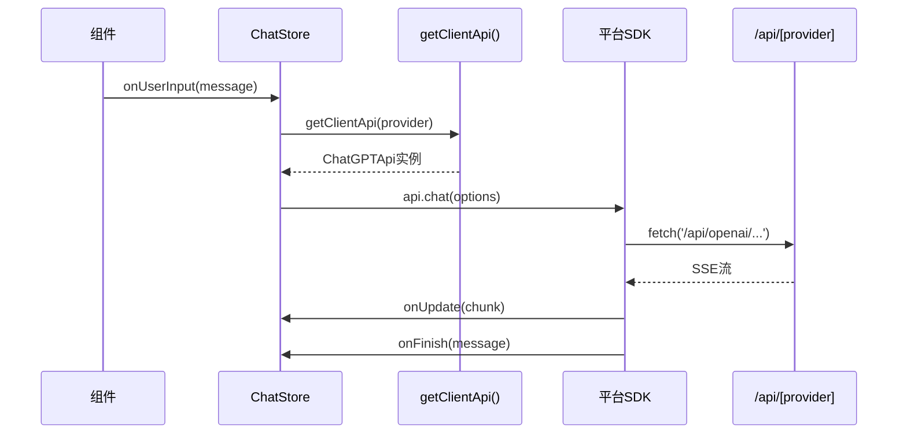

# app/client 模块文档

[根目录](../../CLAUDE.md) > [app](..) > **client**

---

## 变更记录

### 2025-11-19 21:05:15

- 初始化模块文档
- 记录所有AI平台客户端SDK

---

## 模块职责

`app/client` 是**客户端AI SDK模块**，负责：

1. 封装各AI服务商的API调用逻辑
2. 统一请求格式和响应处理
3. 处理流式响应（SSE）
4. 管理请求控制（中断、超时）

**核心设计**: 前端代码通过这些SDK调用 `/api/*` 路由，而非直接调用AI服务商API。

---

## 对外接口

### 主要导出

```typescript
// api.ts
export const ROLES = ["system", "user", "assistant"] as const;
export type MessageRole = (typeof ROLES)[number];

export interface RequestMessage {
  role: MessageRole;
  content: string | MultimodalContent[];
}

export interface ChatOptions {
  messages: RequestMessage[];
  config: LLMConfig;
  onUpdate?: (message: string, chunk: string) => void;
  onFinish: (message: string, response: Response) => void;
  onError?: (err: Error) => void;
  onController?: (controller: AbortController) => void;
}

export interface ClientApi {
  chat(options: ChatOptions): Promise<void>;
  speech(options: SpeechOptions): Promise<ArrayBuffer>;
  usage(): Promise<LLMUsage>;
  models(): Promise<LLMModel[]>;
}

// 获取指定服务商的客户端API
export function getClientApi(provider: ServiceProvider): ClientApi;
```

### 平台SDK列表

| 文件                       | 类名             | 服务商           |
| -------------------------- | ---------------- | ---------------- |
| `platforms/openai.ts`      | `ChatGPTApi`     | OpenAI           |
| `platforms/anthropic.ts`   | `ClaudeApi`      | Anthropic Claude |
| `platforms/google.ts`      | `GeminiProApi`   | Google Gemini    |
| `platforms/baidu.ts`       | `ErnieApi`       | 百度文心一言     |
| `platforms/bytedance.ts`   | `DoubaoApi`      | 字节跳动豆包     |
| `platforms/alibaba.ts`     | `QwenApi`        | 阿里通义千问     |
| `platforms/tencent.ts`     | `HunyuanApi`     | 腾讯混元         |
| `platforms/moonshot.ts`    | `MoonshotApi`    | 月之暗面         |
| `platforms/iflytek.ts`     | `SparkApi`       | 讯飞星火         |
| `platforms/deepseek.ts`    | `DeepSeekApi`    | DeepSeek         |
| `platforms/xai.ts`         | `XAIApi`         | xAI Grok         |
| `platforms/glm.ts`         | `ChatGLMApi`     | 智谱ChatGLM      |
| `platforms/siliconflow.ts` | `SiliconflowApi` | 硅基流动         |
| `platforms/ai302.ts`       | `Ai302Api`       | 302.AI           |

---

## 入口与启动

### 核心入口文件

**api.ts** - SDK统一接口定义和工厂函数

```typescript
import { ChatGPTApi } from "./platforms/openai";
import { ClaudeApi } from "./platforms/anthropic";
// ... 其他导入

export function getClientApi(provider: ServiceProvider): ClientApi {
  switch (provider) {
    case ServiceProvider.OpenAI:
      return new ChatGPTApi();
    case ServiceProvider.Anthropic:
      return new ClaudeApi();
    case ServiceProvider.Google:
      return new GeminiProApi();
    // ... 其他服务商
    default:
      return new ChatGPTApi();
  }
}
```

**controller.ts** - 请求控制管理

```typescript
export class ChatControllerPool {
  private static controllers: Record<string, AbortController> = {};

  static addController(key: string, controller: AbortController) { ... }
  static stop(key: string) { ... }
  static stopAll() { ... }
  static hasPending() { ... }
}
```

### 调用流程



---

## 关键依赖与配置

### 依赖项

- `@fortaine/fetch-event-source`: SSE流式请求
- `@/app/config/client`: 客户端配置
- `@/app/store`: 状态管理（获取配置）
- `@/app/constant`: 常量定义

### 配置获取

```typescript
import { useAccessStore } from "@/app/store";

// 在SDK中获取用户配置
const accessStore = useAccessStore.getState();
const apiKey = accessStore.openaiApiKey;
const apiUrl = accessStore.openaiUrl;
```

---

## 数据模型

### 请求类型

```typescript
// 通用LLM配置
export interface LLMConfig {
  model: string;
  providerName?: string;
  temperature?: number;
  top_p?: number;
  stream?: boolean;
  presence_penalty?: number;
  frequency_penalty?: number;
  size?: DalleRequestPayload["size"]; // 图像生成
  quality?: DalleRequestPayload["quality"]; // 图像质量
  style?: DalleRequestPayload["style"]; // 图像风格
}

// 多模态内容
export interface MultimodalContent {
  type: "text" | "image_url";
  text?: string;
  image_url?: { url: string };
}

// TTS语音合成
export interface SpeechOptions {
  model: string;
  input: string;
  voice: string;
  response_format?: string;
  speed?: number;
  onController?: (controller: AbortController) => void;
}
```

### 响应类型

```typescript
// 模型信息
export interface LLMModel {
  name: string;
  displayName?: string;
  available: boolean;
  provider: LLMModelProvider;
  sorted: number;
}

// 用量信息
export interface LLMUsage {
  used: number;
  total: number;
}
```

---

## 核心逻辑

### 1. ChatGPTApi 实现示例

```typescript
export class ChatGPTApi implements ClientApi {
  private disableListModels = true;

  path(path: string): string {
    const accessStore = useAccessStore.getState();
    let baseUrl = accessStore.openaiUrl || OPENAI_BASE_URL;
    return `${baseUrl}/${path}`;
  }

  async chat(options: ChatOptions) {
    const messages = options.messages.map((m) => ({
      role: m.role,
      content: m.content,
    }));

    const requestPayload = {
      messages,
      stream: options.config.stream,
      model: options.config.model,
      temperature: options.config.temperature,
      // ...
    };

    const controller = new AbortController();
    options.onController?.(controller);

    if (options.config.stream) {
      // 流式请求
      fetchEventSource(this.path("v1/chat/completions"), {
        method: "POST",
        body: JSON.stringify(requestPayload),
        signal: controller.signal,
        headers: this.getHeaders(),
        onmessage(msg) {
          if (msg.data === "[DONE]") return;
          const chunk = JSON.parse(msg.data);
          const content = chunk.choices?.[0]?.delta?.content || "";
          options.onUpdate?.(currentMessage + content, content);
        },
        onclose() {
          options.onFinish(currentMessage, response);
        },
        onerror(error) {
          options.onError?.(error);
        },
      });
    } else {
      // 非流式请求
      const res = await fetch(this.path("v1/chat/completions"), {
        method: "POST",
        body: JSON.stringify(requestPayload),
        headers: this.getHeaders(),
      });
      const json = await res.json();
      options.onFinish(json.choices[0].message.content, res);
    }
  }

  getHeaders() {
    const accessStore = useAccessStore.getState();
    return {
      "Content-Type": "application/json",
      Authorization: `Bearer ${accessStore.openaiApiKey || accessStore.accessCode}`,
    };
  }

  async speech(options: SpeechOptions): Promise<ArrayBuffer> { ... }
  async usage(): Promise<LLMUsage> { ... }
  async models(): Promise<LLMModel[]> { ... }
}
```

### 2. 流式响应处理

```typescript
import { fetchEventSource } from "@fortaine/fetch-event-source";

fetchEventSource(url, {
  method: "POST",
  body: JSON.stringify(payload),
  headers: headers,
  signal: controller.signal,

  async onopen(response) {
    if (!response.ok) {
      throw new Error(`HTTP ${response.status}`);
    }
  },

  onmessage(event) {
    if (event.data === "[DONE]") {
      return;
    }

    try {
      const data = JSON.parse(event.data);
      const content = data.choices?.[0]?.delta?.content;
      if (content) {
        message += content;
        options.onUpdate?.(message, content);
      }
    } catch (e) {
      console.error("Parse error:", e);
    }
  },

  onclose() {
    options.onFinish(message, response);
  },

  onerror(error) {
    options.onError?.(error);
    throw error;
  },
});
```

### 3. 请求控制器

```typescript
// controller.ts
export class ChatControllerPool {
  private static controllers: Record<string, AbortController> = {};

  static addController(sessionId: string, controller: AbortController) {
    this.controllers[sessionId] = controller;
  }

  static stop(sessionId: string) {
    const controller = this.controllers[sessionId];
    if (controller) {
      controller.abort();
      delete this.controllers[sessionId];
    }
  }

  static stopAll() {
    Object.values(this.controllers).forEach((c) => c.abort());
    this.controllers = {};
  }
}

// 使用示例
const controller = new AbortController();
ChatControllerPool.addController(sessionId, controller);
options.onController?.(controller);

// 用户点击停止按钮
ChatControllerPool.stop(sessionId);
```

---

## 测试与质量

### 测试策略

- **手动测试**: 根据项目要求，由开发者手动测试SDK功能
- **测试场景**:
  - 各服务商的连通性
  - 流式/非流式响应
  - 请求中断
  - 错误处理
  - 多模态内容（图片上传）

### 调试技巧

**查看网络请求**

1. 打开浏览器DevTools → Network
2. 筛选 `api/` 请求
3. 查看Request Payload和Response

**测试单个SDK**

```typescript
// 在浏览器Console中
import { ChatGPTApi } from "@/app/client/platforms/openai";

const api = new ChatGPTApi();
api.chat({
  messages: [{ role: "user", content: "Hello" }],
  config: { model: "gpt-3.5-turbo", stream: true },
  onUpdate: (msg, chunk) => console.log("Chunk:", chunk),
  onFinish: (msg) => console.log("Done:", msg),
  onError: (err) => console.error(err),
});
```

---

## 常见问题 (FAQ)

### Q1: 如何添加新的AI平台SDK？

1. 在 `platforms/` 创建新文件，如 `newplatform.ts`
2. 实现 `ClientApi` 接口
3. 在 `api.ts` 的 `getClientApi` 中添加case
4. 在 `app/constant.ts` 添加 `ServiceProvider` 枚举

### Q2: 为什么流式响应卡住？

可能原因：

1. 网络问题导致连接中断
2. 服务商限流
3. `[DONE]` 标记未正确处理
4. `AbortController` 被错误中断

### Q3: 如何处理不同服务商的响应格式差异？

每个平台SDK内部做格式适配，对外统一返回 `ChatOptions.onUpdate/onFinish` 格式。

### Q4: 请求超时如何配置？

在 `app/constant.ts` 中：

```typescript
export const REQUEST_TIMEOUT_MS = 120000; // 2分钟
export const REQUEST_TIMEOUT_MS_FOR_THINKING = REQUEST_TIMEOUT_MS * 5; // 10分钟
```

### Q5: 如何支持Tools/Function Calling？

在 `ChatOptions` 中添加 `onBeforeTool` 和 `onAfterTool` 回调，SDK在收到工具调用时触发。

---

## 相关文件清单

```
app/client/
├── api.ts              # 统一接口定义 + 工厂函数
├── controller.ts       # 请求控制器
│
└── platforms/          # 各平台SDK实现
    ├── openai.ts       # OpenAI (ChatGPTApi)
    ├── anthropic.ts    # Claude (ClaudeApi)
    ├── google.ts       # Gemini (GeminiProApi)
    ├── baidu.ts        # 百度文心 (ErnieApi)
    ├── bytedance.ts    # 字节豆包 (DoubaoApi)
    ├── alibaba.ts      # 阿里通义 (QwenApi)
    ├── tencent.ts      # 腾讯混元 (HunyuanApi)
    ├── moonshot.ts     # 月之暗面 (MoonshotApi)
    ├── iflytek.ts      # 讯飞星火 (SparkApi)
    ├── deepseek.ts     # DeepSeek (DeepSeekApi)
    ├── xai.ts          # xAI Grok (XAIApi)
    ├── glm.ts          # 智谱 (ChatGLMApi)
    ├── siliconflow.ts  # 硅基流动 (SiliconflowApi)
    └── ai302.ts        # 302.AI (Ai302Api)
```

---

## 开发注意事项

1. **接口一致性**: 所有SDK必须实现 `ClientApi` 接口
2. **错误处理**: 统一使用 `onError` 回调，不要抛出未捕获异常
3. **流式完整性**: 确保 `onFinish` 在任何情况下都被调用
4. **内存泄漏**: 取消请求时正确清理 `AbortController`
5. **类型安全**: 使用TypeScript严格模式，避免any

```typescript
// 推荐模式
class NewPlatformApi implements ClientApi {
  async chat(options: ChatOptions): Promise<void> {
    try {
      // 实现逻辑
    } catch (error) {
      options.onError?.(error as Error);
    } finally {
      // 确保onFinish被调用
    }
  }
}
```

---

**文档维护**: 添加新平台SDK或修改接口时，需同步更新此文档。
