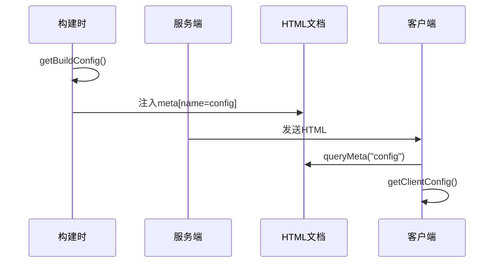

# app/config 模块文档

[根目录](../../CLAUDE.md) > [app](..) > **config**

---

## 变更记录

### 2025-11-19 21:05:15

- 初始化模块文档
- 记录配置管理系统

---

## 模块职责

`app/config` 是**配置管理模块**，负责：

1. 定义和获取服务端配置（环境变量）
2. 定义和获取客户端配置（构建时注入）
3. 分离服务端/客户端配置边界
4. 提供类型安全的配置访问

---

## 对外接口

### 导出函数

```typescript
// server.ts - 服务端专用
export function getServerSideConfig(): ServerConfig;

// client.ts - 客户端/服务端通用
export function getClientConfig(): BuildConfig;

// build.ts - 构建配置
export function getBuildConfig(): BuildConfig;
```

### 使用位置

| 函数                    | 可用环境      | 使用场景              |
| ----------------------- | ------------- | --------------------- |
| `getServerSideConfig()` | 仅服务端      | API路由、服务端组件   |
| `getClientConfig()`     | 客户端+服务端 | React组件、客户端代码 |
| `getBuildConfig()`      | 构建时        | 注入到HTML meta标签   |

---

## 入口与启动

### 文件结构

```
app/config/
├── server.ts   # 服务端配置（环境变量）
├── client.ts   # 客户端配置（从meta标签读取）
└── build.ts    # 构建时配置
```

### 配置注入流程



---

## 关键依赖与配置

### 依赖项

- `spark-md5`: 访问码哈希
- `@/app/constant`: 默认值定义

### 环境变量来源

- `.env.local`: 本地开发
- `.env`: 生产默认值
- Vercel/Docker环境变量: 部署时注入

---

## 数据模型

### ServerConfig（服务端配置）

```typescript
interface ServerConfig {
  // OpenAI
  baseUrl?: string;
  apiKey?: string;
  openaiOrgId?: string;

  // Azure
  isAzure: boolean;
  azureUrl?: string;
  azureApiKey?: string;
  azureApiVersion?: string;

  // Google
  isGoogle: boolean;
  googleApiKey?: string;
  googleUrl?: string;

  // Anthropic
  isAnthropic: boolean;
  anthropicApiKey?: string;
  anthropicUrl?: string;
  anthropicApiVersion?: string;

  // 国内服务商
  isBaidu: boolean;
  baiduUrl?: string;
  baiduApiKey?: string;
  baiduSecretKey?: string;

  isBytedance: boolean;
  bytedanceUrl?: string;
  bytedanceApiKey?: string;

  isAlibaba: boolean;
  alibabaUrl?: string;
  alibabaApiKey?: string;

  isMoonshot: boolean;
  moonshotUrl?: string;
  moonshotApiKey?: string;

  isIflytek: boolean;
  iflytekUrl?: string;
  iflytekApiKey?: string;
  iflytekApiSecret?: string;

  isDeepSeek: boolean;
  deepseekUrl?: string;
  deepseekApiKey?: string;

  isChatGLM: boolean;
  chatglmUrl?: string;
  chatglmApiKey?: string;

  // 其他服务
  isStability: boolean;
  stabilityUrl?: string;
  stabilityApiKey?: string;

  isSiliconFlow: boolean;
  siliconFlowUrl?: string;
  siliconFlowApiKey?: string;

  isAI302: boolean;
  ai302Url?: string;
  ai302ApiKey?: string;

  // 访问控制
  needCode: boolean;
  code?: string;
  codes: Set<string>;

  // 功能开关
  hideUserApiKey: boolean;
  disableGPT4: boolean;
  hideBalanceQuery: boolean;
  disableFastLink: boolean;

  // 模型配置
  customModels: string;
  defaultModel: string;
  visionModels: string;

  // 网络配置
  proxyUrl?: string;
  isVercel: boolean;
  allowedWebDavEndpoints: string[];

  // 监控
  gtmId?: string;
  gaId?: string;

  // MCP
  enableMcp: boolean;
}
```

### BuildConfig（客户端配置）

```typescript
interface BuildConfig {
  commitId?: string;
  buildMode: "standalone" | "export";
  isApp: boolean;
  version: string;
}
```

---

## 核心逻辑

### 1. 服务端配置获取 (server.ts)

```typescript
export const getServerSideConfig = () => {
  // 安全检查：只能在Node环境运行
  if (typeof process === "undefined") {
    throw Error(
      "[Server Config] you are importing a nodejs-only module outside of nodejs",
    );
  }

  // 处理GPT4禁用逻辑
  const disableGPT4 = !!process.env.DISABLE_GPT4;
  let customModels = process.env.CUSTOM_MODELS ?? "";
  if (disableGPT4) {
    customModels += DEFAULT_MODELS.filter((m) => isGPT4Model(m.name))
      .map((m) => "-" + m.name)
      .join(",");
  }

  // API密钥随机选择（支持多密钥轮询）
  const getApiKey = (keys?: string) => {
    const apiKeys = (keys ?? "").split(",").map((v) => v.trim());
    return apiKeys[Math.floor(Math.random() * apiKeys.length)];
  };

  return {
    baseUrl: process.env.BASE_URL,
    apiKey: getApiKey(process.env.OPENAI_API_KEY),
    // ... 其他配置
  };
};
```

### 2. 客户端配置获取 (client.ts)

```typescript
export function getClientConfig() {
  // 客户端：从HTML meta标签读取
  if (typeof document !== "undefined") {
    const meta = document.head.querySelector('meta[name="config"]');
    return JSON.parse(meta?.content || "{}") as BuildConfig;
  }

  // 服务端：直接获取构建配置
  if (typeof process !== "undefined") {
    return getBuildConfig();
  }
}
```

### 3. 构建配置 (build.ts)

```typescript
export function getBuildConfig(): BuildConfig {
  return {
    commitId: process.env.VERCEL_GIT_COMMIT_SHA || "unknown",
    buildMode: process.env.BUILD_MODE || "standalone",
    isApp: !!process.env.BUILD_APP,
    version: "2.x.x", // 从package.json读取
  };
}
```

### 4. 访问码验证

```typescript
// server.ts
const ACCESS_CODES = (function getAccessCodes(): Set<string> {
  const code = process.env.CODE;
  try {
    const codes = (code?.split(",") ?? [])
      .filter((v) => !!v)
      .map((v) => md5.hash(v.trim())); // MD5哈希存储
    return new Set(codes);
  } catch (e) {
    return new Set();
  }
})();

// 验证时比较哈希值
// needCode: ACCESS_CODES.size > 0
// codes: ACCESS_CODES
```

---

## 测试与质量

### 测试策略

- **手动测试**: 验证各环境变量是否正确加载
- **测试场景**:
  - 环境变量缺失时的默认值
  - 多API密钥轮询
  - 访问码验证
  - 模型禁用逻辑

### 调试技巧

**查看服务端配置**

```typescript
// 在API路由中
const config = getServerSideConfig();
console.log(JSON.stringify(config, null, 2));
```

**查看客户端配置**

```javascript
// 在浏览器Console中
JSON.parse(document.querySelector('meta[name="config"]').content);
```

**检查环境变量**

```bash
# 本地开发
cat .env.local

# Vercel
vercel env pull
```

---

## 常见问题 (FAQ)

### Q1: 为什么区分服务端和客户端配置？

**安全原因**: 服务端配置包含API密钥等敏感信息，不能暴露给客户端。客户端配置只包含非敏感的构建信息。

### Q2: 如何添加新的环境变量？

1. 在 `server.ts` 的 `ProcessEnv` 接口添加类型定义
2. 在 `getServerSideConfig()` 返回值中添加
3. 更新 README.md 文档

### Q3: 为什么访问码使用MD5？

存储哈希值而非明文，即使服务端被入侵也不会泄露原始密码。验证时将用户输入哈希后与存储值比对。

### Q4: 多API密钥如何轮询？

```bash
OPENAI_API_KEY=sk-key1,sk-key2,sk-key3
```

每次请求随机选择一个密钥，分散请求负载。

### Q5: 如何在本地模拟Vercel环境？

```bash
# 使用Vercel CLI
vercel dev

# 或手动设置环境变量
VERCEL=1 yarn dev
```

---

## 相关文件清单

```
app/config/
├── server.ts   # 服务端配置
├── client.ts   # 客户端配置获取
└── build.ts    # 构建时配置

相关文件：
├── .env.local          # 本地环境变量（不提交）
├── .env                # 默认环境变量
└── app/constant.ts     # 默认值常量
```

---

## 环境变量完整列表

详见 [根目录 CLAUDE.md](../../CLAUDE.md) 和 [README_CN.md](../../README_CN.md#环境变量)。

核心变量：

```bash
# 必填
OPENAI_API_KEY=sk-xxx

# 强烈推荐
CODE=password1,password2

# 可选配置
BASE_URL=https://api.openai.com
CUSTOM_MODELS=+custom-model,-gpt-3.5
DEFAULT_MODEL=gpt-4
PROXY_URL=http://127.0.0.1:7890

# 各服务商API密钥
ANTHROPIC_API_KEY=
GOOGLE_API_KEY=
AZURE_API_KEY=
# ... 更多
```

---

## 开发注意事项

1. **环境隔离**: 服务端代码不要导入到客户端bundle
2. **类型安全**: 使用TypeScript严格模式
3. **默认值**: 环境变量缺失时提供合理默认值
4. **验证**: 敏感操作前验证配置有效性
5. **日志脱敏**: 不要完整记录API密钥

```typescript
// 错误示例
console.log("API Key:", config.apiKey);

// 正确示例
console.log("API Key:", config.apiKey?.slice(0, 10) + "...");
```

---

**文档维护**: 添加新环境变量时，需同步更新此文档和README。
